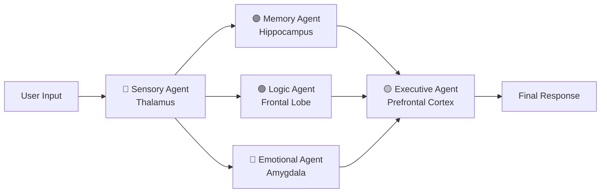

<div align="center">

# 🧠 Brain System

### A Multi-Agent Cognitive Architecture Powered by LangGraph

*Five specialized AI agents — modeled after the human brain — collaborate to process your input and generate thoughtful, nuanced responses.*

[](https://www.python.org/downloads/)
[](https://github.com/langchain-ai/langgraph)
[](LICENSE)

</div>

---

## 🧩 How It Works

Brain System maps biological brain functions to specialized AI agents that process every input in parallel — just like the human brain:



| Agent | Brain Analog | What It Does |
|:------|:-------------|:-------------|
| **Sensory** | Thalamus & Sensory Cortex | Parses and classifies raw input |
| **Memory** | Hippocampus | Retrieves relevant past interactions (short & long-term) |
| **Logic** | Left Frontal Lobe | Factual reasoning and analysis |
| **Emotional** | Amygdala & Limbic System | Sentiment, ethics, and emotional context |
| **Executive** | Prefrontal Cortex | Synthesizes all signals into a final decision |

## 🎭 Persona Mode

Upload a biography or autobiography, and the entire Brain responds **as that person would**.

The system extracts personality traits, speech patterns, reasoning style, and emotional tendencies — then injects tailored context into each agent. The Logic Agent thinks in their reasoning style, the Emotional Agent mirrors their emotional tendencies, and the Executive Agent speaks in their voice.

> **Example:** Upload Nelson Mandela's autobiography → ask about dealing with conflict → get a response reflecting his values of reconciliation, strategic patience, and ubuntu philosophy.

## 🚀 Quick Start

### 1. Clone & Install

```bash
git clone https://github.com/shivamtyagi18/BRAIN.git
cd BRAIN
pip install -r brain_system/requirements.txt
```

### 2. Configure (Optional)

Create a `.env` file in the project root for cloud providers:

```env
# Only needed if using Gemini or OpenAI
GOOGLE_API_KEY=your_key_here
OPENAI_API_KEY=your_key_here
```

> **No API key needed for Ollama** — runs entirely on your local machine.

### 3. Run

#### Web UI (Recommended)
```bash
python3.11 -m brain_system.app
```
Open **http://localhost:5001** in your browser.

#### Command Line
```bash
python3.11 -m brain_system.main
```

## 🖥️ Web Interface

The web UI features:
- **Provider selection** — choose Gemini, OpenAI, or Ollama at startup
- **Persona upload** — drag & drop a `.txt` or `.pdf` biography
- **Live chat** — dark-mode interface with agent activity indicators
- **Mid-conversation persona switching** — change or clear persona without restarting

## 🤖 Supported LLM Providers

| Provider | Requirements | Best For |
|:---------|:-------------|:---------|
| **Ollama** | [Ollama](https://ollama.ai) installed locally | Privacy, offline use, no cost |
| **Gemini** | `GOOGLE_API_KEY` in `.env` | High-quality responses |
| **OpenAI** | `OPENAI_API_KEY` in `.env` | GPT-4 class models |

### Using Ollama (Local)

```bash
# Install Ollama, then pull a model:
ollama pull mistral

# For uncensored output, try:
ollama pull dolphin-mistral
```

## 📁 Project Structure

```
brain-system/
├── run.sh                          # Single-command launcher
└── brain_system/
    ├── app.py                      # Flask web server (API + UI)
    ├── main.py                     # CLI entry point
    ├── requirements.txt
    ├── agents/
    │   ├── base_agent.py           # Abstract base with persona injection
    │   ├── sensory_agent.py        # Input parsing (Thalamus)
    │   ├── memory_agent.py         # Context retrieval (Hippocampus)
    │   ├── emotional_agent.py      # Sentiment analysis (Amygdala)
    │   ├── logic_agent.py          # Reasoning (Frontal Lobe)
    │   └── executive_agent.py      # Decision synthesis (PFC)
    ├── core/
    │   ├── orchestrator.py         # LangGraph workflow engine
    │   ├── llm_interface.py        # Multi-provider LLM factory
    │   ├── memory_store.py         # Persistent memory (JSON)
    │   ├── document_loader.py      # TXT/PDF document ingestion
    │   └── persona.py              # Persona extraction & injection
    └── web/
        ├── templates/index.html    # Chat interface
        └── static/
            ├── css/style.css       # Dark-mode theme
            └── js/app.js           # Frontend logic
```

## 🔧 Architecture Highlights

- **LangGraph Orchestration** — Agents run as nodes in a compiled state graph with parallel execution for Memory, Logic, and Emotional processing
- **Modular LLM Factory** — Swap providers with a single parameter; no code changes needed
- **Dual Memory** — Short-term (conversation context) + Long-term (persistent JSON store with keyword retrieval)
- **Persona Injection** — Role-specific context: each agent gets *different* aspects of the persona profile tailored to its function

## 🤝 Contributing

Contributions are welcome! Some ideas:

- **Vector memory** — Replace JSON keyword search with embedding-based retrieval
- **Additional agents** — Add a Creativity Agent, Social Agent, or Moral Reasoning Agent
- **Streaming responses** — Real-time token streaming in the web UI
- **Multi-turn persona** — Let the persona evolve based on the conversation
- **Agent transparency** — Show individual agent outputs before the final synthesis

## 📝 License

MIT License — see [LICENSE](LICENSE) for details.

---

<div align="center">
<i>Built with 🧠 by mapping neuroscience to multi-agent AI</i>
</div>
