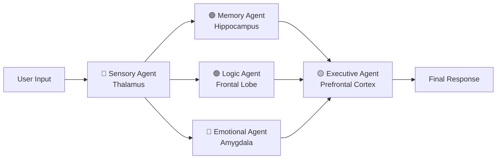

<div align="center">

# 🧠 Brain System

### A Multi-Agent Cognitive Architecture Powered by LangGraph

*Five specialized AI agents — modeled after the human brain — collaborate to process your input and generate thoughtful, nuanced responses.*

[](https://www.python.org/downloads/)
[](https://pypi.org/project/brain-system/)
[](https://github.com/langchain-ai/langgraph)
[](LICENSE)

</div>

---

## 🧩 How It Works

Brain System maps biological brain functions to specialized AI agents that process every input in parallel — just like the human brain:



| Agent | Brain Analog | What It Does |
|:------|:-------------|:-------------|
| **Sensory** | Thalamus & Sensory Cortex | Multi-layer signal classification, pattern recognition, salience detection |
| **Memory** | Hippocampus & DLPFC | LLM-driven contextual synthesis, associative linking, temporal weighting |
| **Logic** | Left Frontal Lobe & DLPFC | Deductive/inductive reasoning, fallacy detection, counter-arguments |
| **Emotional** | Amygdala, Insula & Cingulate | Emotional profiling, empathy reading, ethical safety checks |
| **Executive** | Full Prefrontal Cortex | Conflict resolution between agents, response calibration, integrated output |

## 🎭 Persona Mode

Upload a biography or autobiography, and the entire Brain responds **as that person would**.

The system extracts personality traits, speech patterns, reasoning style, and emotional tendencies — then injects tailored context into each agent. The Logic Agent thinks in their reasoning style, the Emotional Agent mirrors their emotional tendencies, and the Executive Agent speaks in their voice.

> **Example:** Upload Nelson Mandela's autobiography → ask about dealing with conflict → get a response reflecting his values of reconciliation, strategic patience, and ubuntu philosophy.

## 📦 Install

```bash
pip install brain-system
```

> For the web UI, install the optional extra: `pip install brain-system[web]`

## 🚀 Quick Start — Library Usage

```python
from brain_system import BrainWrapper

# Create a Brain (choose provider: "gemini", "openai", or "ollama")
brain = BrainWrapper(provider="ollama", model_name="mistral")

# Process input through all 5 agents
result = brain.think("What is the meaning of justice?")

# Get the final synthesized response
print(result.response)

# Inspect individual agent signals
print(result.sensory)     # Thalamus — input classification
print(result.memory)      # Hippocampus — memory context
print(result.logic)       # Frontal Lobe — logical analysis
print(result.emotional)   # Amygdala — emotional analysis
```

### Persona Mode

Upload a biography/autobiography (`.txt` or `.pdf`) and the Brain responds as that person. Pass a **relative path** (resolved from your working directory) or an **absolute path**:

```python
# Relative path — looks in the directory where you run your script
brain.load_persona("gandhi_autobiography.pdf")

# Absolute path — works from anywhere
brain.load_persona("/Users/you/documents/gandhi_autobiography.pdf")

result = brain.think("How should we deal with injustice?")
print(result.response)    # Responds in Gandhi's voice

brain.clear_persona()     # Revert to default
```

### Memory Management

```python
# Custom memory file location
brain = BrainWrapper(provider="gemini", memory_path="./my_memory.json")

# Clear all stored memories
brain.clear_memory()
```

### API Reference

| Class / Method | Description |
|:---|:---|
| `BrainWrapper(provider, model_name, memory_path)` | Create a Brain instance |
| `.think(input) → BrainResult` | Process input through the 5-agent pipeline |
| `.load_persona(filepath)` | Load a persona from `.txt` or `.pdf` |
| `.clear_persona()` | Remove the active persona |
| `.clear_memory()` | Erase all long-term memories |
| `.persona_active` | `bool` — is a persona loaded? |
| `.persona_name` | Name of the active persona |
| `BrainResult.response` | Final synthesized response |
| `BrainResult.agent_signals` | `dict` of each agent's raw output |
| `BrainResult.sensory / .memory / .logic / .emotional` | Shortcut accessors |

See [`examples/`](examples/) for complete usage scripts.

---

## 🖥️ Development Setup

### Clone & Install

```bash
git clone https://github.com/shivamtyagi18/BRAIN.git
cd BRAIN
pip install -e ".[web,dev]"
```

### Configure (Optional)

Create a `.env` file in the project root for cloud providers:

```env
# Only needed if using Gemini or OpenAI
GOOGLE_API_KEY=your_key_here
OPENAI_API_KEY=your_key_here
```

> **No API key needed for Ollama** — runs entirely on your local machine.

### Run

#### Web UI
```bash
python -m brain_system.app
```
Open **http://localhost:5001** in your browser.

#### Command Line
```bash
brain-cli
```

## 🖥️ Web Interface

The web UI features:
- **Provider selection** — choose Gemini, OpenAI, or Ollama at startup
- **Persona upload** — drag & drop a `.txt` or `.pdf` biography
- **Live chat** — dark-mode interface with agent activity indicators
- **Agent transparency** — expand each agent's internal reasoning with "Show agent signals"
- **Mid-conversation persona switching** — change or clear persona without restarting
- **New Chat** — full reset button to start fresh
- **Clear Memory** — wipe stored memories without restarting

## 🤖 Supported LLM Providers

| Provider | Requirements | Best For |
|:---------|:-------------|:---------|
| **Ollama** | [Ollama](https://ollama.ai) installed locally | Privacy, offline use, no cost |
| **Gemini** | `GOOGLE_API_KEY` in `.env` | High-quality responses |
| **OpenAI** | `OPENAI_API_KEY` in `.env` | GPT-4 class models |

### Using Ollama (Local)

```bash
# Install Ollama, then pull a model:
ollama pull mistral

# For uncensored output, try:
ollama pull dolphin-mistral
```

## 📁 Project Structure

```
brain-system/
├── pyproject.toml                  # Package config & dependencies
├── run.sh                          # Single-command launcher
├── examples/
│   ├── basic_usage.py              # Minimal library usage
│   ├── persona_mode.py             # Persona loading example
│   └── custom_provider.py          # Provider switching example
└── brain_system/
    ├── __init__.py                 # Public API exports
    ├── wrapper.py                  # BrainWrapper — developer entry point
    ├── app.py                      # Flask web server (optional)
    ├── main.py                     # CLI entry point
    ├── agents/
    │   ├── base_agent.py           # Abstract base with persona injection
    │   ├── sensory_agent.py        # Input parsing (Thalamus)
    │   ├── memory_agent.py         # Context retrieval (Hippocampus)
    │   ├── emotional_agent.py      # Sentiment analysis (Amygdala)
    │   ├── logic_agent.py          # Reasoning (Frontal Lobe)
    │   └── executive_agent.py      # Decision synthesis (PFC)
    ├── core/
    │   ├── orchestrator.py         # LangGraph workflow engine
    │   ├── llm_interface.py        # Multi-provider LLM factory
    │   ├── memory_store.py         # Persistent memory (JSON)
    │   ├── document_loader.py      # TXT/PDF document ingestion
    │   └── persona.py              # Persona extraction & injection
    └── web/
        ├── templates/index.html    # Chat interface
        └── static/
            ├── css/style.css       # Dark-mode theme
            └── js/app.js           # Frontend logic
```

## 🔧 Architecture Highlights

- **LangGraph Orchestration** — Agents run as nodes in a compiled state graph with parallel execution for Memory, Logic, and Emotional processing
- **Modular LLM Factory** — Swap providers with a single parameter; no code changes needed
- **Dual Memory** — Short-term (conversation context) + Long-term (persistent JSON store with keyword retrieval)
- **Persona Injection** — Role-specific context: each agent gets *different* aspects of the persona profile tailored to its function

## 🤝 Contributing

Contributions are welcome! Some ideas:

- **Vector memory** — Replace JSON keyword search with embedding-based retrieval
- **Additional agents** — Add a Creativity Agent, Social Agent, or Moral Reasoning Agent
- **Streaming responses** — Real-time token streaming in the web UI
- **Multi-turn persona** — Let the persona evolve based on the conversation
- **Voice interface** — Add speech-to-text input and text-to-speech output

## 📝 License

MIT License — see [LICENSE](LICENSE) for details.

---

<div align="center">
<i>Built with 🧠 by mapping neuroscience to multi-agent AI</i>
</div>
